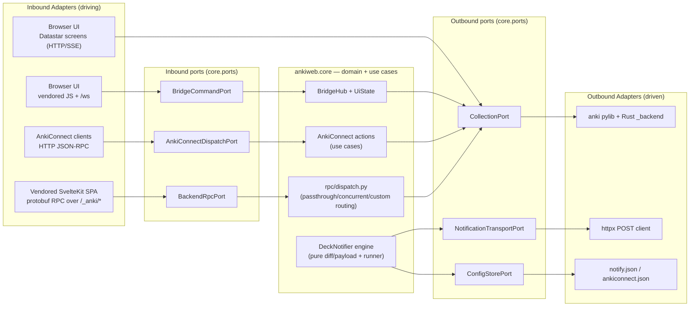
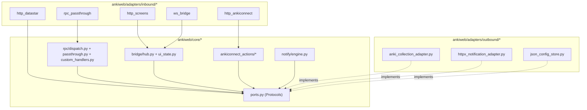
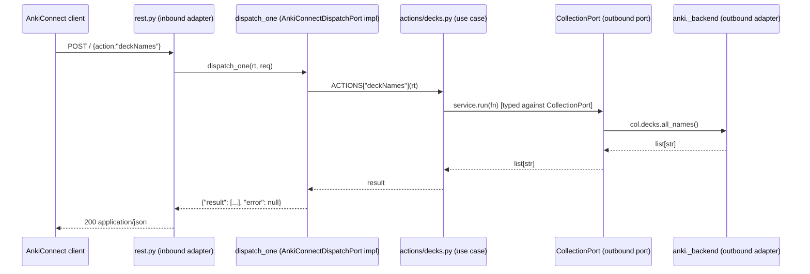

# ankiweb Sub-project — Hexagonal Architecture (Ports & Adapters) — Design

**Status:** design (2026-09-12). Follow-up to the 2026-09-12 code-quality pass (`ruff`/`ty`/`wily`).
No behavior change is in scope — this is an **internal restructuring** to lower coupling between
transport protocols (server-rendered Datastar screens, the WebSocket-bridged vendored-frontend
screens, AnkiConnect JSON-RPC, the vendored SvelteKit protobuf RPC) and the one thing ankiweb
actually orchestrates: a single Anki
`Collection` it does not own the business rules of.

## Goal

Restructure `ankiweb` around **Hexagonal Architecture** (Ports & Adapters, Cockburn) so that:

1. The **application core** (bridge session state, AnkiConnect use-cases, the deck notifier
   engine, UI-state mirror) has **zero imports** of FastAPI/Starlette/`httpx`/filesystem/`anki`
   backend types — it depends only on **Protocols** (ports) it defines.
2. Every external system ankiweb talks to — the `anki` pylib + Rust `_backend`, outbound HTTP
   (deck-notifier webhooks), JSON config files (`notify.json`, `ankiconnect.json`), and vendored
   static assets — sits behind an **outbound port**, swappable for a test double without
   monkeypatching internals.
3. Every way a client reaches ankiweb — the browser's **Datastar-driven** screens (deckbrowser,
   overview, browser, card layout, custom study, filtered deck, fields, note types, preferences,
   tools), the browser's **WebSocket-bridged** vendored-frontend screens (reviewer, editor, add —
   Anki's own compiled JS calling `pycmd`/`bridgeCommand`), AnkiConnect HTTP clients, and the
   vendored SvelteKit SPA's protobuf RPC — is an **inbound adapter** that calls into the core
   through an **inbound port**, not by importing screen/action internals directly.
4. The dependency direction is enforced and **testable**: adapters may depend on the core;
   the core may depend only on its own `ports.py`; adapters never depend on each other.

## Why now (grounded in this session's tool output)

The 2026-09-12 `wily`/`ruff`/`ty` pass (see `README.md#architecture` for current file list) found
the highest cyclomatic complexity concentrated exactly where transport-protocol code, use-case
validation, and collection access are interleaved in the same functions:

| File | Cyclomatic complexity (wily) | Why it's tangled today |
|---|---:|---|
| `ankiweb/notifier.py` | 76 | Pure diff/payload logic, `NotifierState`, the async runner, **and** the `httpx` client are one file/one class. |
| `ankiweb/ankiconnect/actions/gui.py` | 54 | AnkiConnect param validation + `col._backend`/`col.sched` calls + `BridgeHub` pushes, inline. |
| `ankiweb/ankiconnect/actions/models.py` | 51 | Same shape: validation + direct `col.models.*` calls, no seam for a fake collection. |
| `ankiweb/ankiconnect/actions/notes.py` | 46 | Same shape. |
| `ankiweb/ankiconnect/actions/cards.py` | 37 | Same shape. |
| `ankiweb/anki_rpc/handlers.py` | 34 | Protobuf parsing + `service.backend_raw(...)` + `BridgeHub` broadcast, inline. |
| `ankiweb/ankiconnect/actions/decks.py` | 24 | Same shape. |
| `ankiweb/collection_service.py` | 22 | Correctly the seam today, but exposes `col._backend` as an escape hatch (see Scope, below). |

None of this is a defect — it is 100% test-covered (537 passing tests) — but every one of these
modules is unit-tested today by constructing a **real** `anki.collection.Collection` against a
temp file. That works (Anki's pylib is small/fast to spin up), but it means "unit" tests already
pay integration-test cost, and there is no seam to fake failure modes (a `NetworkError` from the
Rust backend, a disk-full on `notify.json` save, a slow webhook) without exercising the real
engine. Formalizing ports gives that seam without touching the (already-adequate) test suite's
assertions — only its fixtures gain an option, not a requirement.

## Target architecture

### Structural view — rings and dependency direction



**Honesty note:** ankiweb does not implement spaced-repetition domain rules — those live in the
`anki` pylib/Rust backend, which the core treats as an **external system behind an outbound
port** (`CollectionPort`), not as "the database." The core's own domain is thin and real:
session/bridge orchestration, AnkiConnect protocol semantics (versioning envelope, API-key
gating, `multi` fan-out), the notifier's diff/coalescing state machine, and DNS-rebinding/auth
token rules. That is what hexagonal isolation actually protects here.

### Dependency-rule view — what may import what



Arrows read "depends on." Note there is **no arrow from `Core` to either adapter subgraph** —
that absence is the rule, and Task 7 of the migration plan adds an automated test that fails the
build if a future edit reintroduces one.

### Behavioral view — one request end-to-end



The WebSocket bridge flow (browser UI) is structurally identical, substituting
`BridgeCommandPort`/`BridgeHub` for `AnkiConnectDispatchPort`/`dispatch_one`, and the SvelteKit
passthrough flow substitutes `BackendRpcPort`/`rpc/dispatch.py` — both terminate at the same
`CollectionPort`. The Datastar screen routers are a fourth inbound adapter but skip an
intermediate port entirely — each route already calls `CollectionPort` directly (see Scope,
below, on why no dedicated port was introduced for them). The point stands regardless: **one
outbound seam, four inbound doors.**

## Ports (interfaces)

All defined in one new module, `ankiweb/core/ports.py`, as `typing.Protocol` classes — no ABC
inheritance required of adapters (structural typing; `ty`/`ruff` already in the toolchain check
this for free).

| Port | Direction | Shape (sketch) | Today's de-facto implementer |
|---|---|---|---|
| `CollectionPort` | outbound | `async run(fn)`, `async run_op(fn, initiator=None)`, `async backend_raw(method, data)`, `async backend_raw_concurrent(method, data)`, `subscribe(cb)`, `async emit(changes, initiator)`, `async open()`, `async close()` | `CollectionService` (`ankiweb/collection_service.py`) |
| `NotificationTransportPort` | outbound | `async post(url, headers, json) -> tuple[int, Any]` | `DeckNotifier._http_post` (`ankiweb/notifier.py`) |
| `ConfigStorePort` | outbound | `load(path) -> T`, `save(value, path) -> None` | `NotifyConfig.load`/`.save`, `AnkiConnectConfig` file IO |
| `ClockPort` | outbound | `now() -> float` | `time.time`, already injected as `DeckNotifier(now=...)` |
| `BridgeCommandPort` | inbound | `async dispatch_cmd(ctx, arg) -> Any`, `async push_call(ctx, fn, args)`, `async push_eval(ctx, js)`, `register/unregister(ctx, ws)` | `BridgeHub` (`ankiweb/bridge/hub.py`) — already this exact shape today |
| `AnkiConnectDispatchPort` | inbound | `async dispatch_one(rt, req, actions=ACTIONS) -> Any` | `dispatch_one` (`ankiweb/ankiconnect/dispatch.py`) — already this exact shape today |
| `BackendRpcPort` | inbound | `async handle(method, body, hub) -> bytes` | the `PASSTHROUGH`/`CONCURRENT`/`CUSTOM` branch, to be extracted from `ankiweb/anki_rpc/__init__.py` into a plain core function (see Task 6 of the migration plan) |

Two of the seven ports (`BridgeCommandPort`, `AnkiConnectDispatchPort`) require **no code
change** — they already have exactly this call shape; the migration only adds the `Protocol`
declaration and a type annotation at the call sites. `BackendRpcPort` is a real extraction:
today's business logic is inline in `anki_rpc/__init__.py`'s FastAPI route closure, not in a
reusable function. This is a strong signal the design fits the existing code where it can, and
is honest about the one place (RPC dispatch) where it doesn't yet.

## Adapters

| Adapter | Kind | Port(s) satisfied | Current location | Target location |
|---|---|---|---|---|
| Datastar screen routers | inbound | `CollectionPort` (consumer, called directly — no dedicated inbound port), HTTP+SSE | `ankiweb/screens/{tools,browser,deckbrowser,overview,card_layout,custom_study,filtered_deck,fields,notetypes,preferences}.py` | `ankiweb/adapters/inbound/http_datastar/*.py` (pure move, same body — see Scope, below) |
| Bridge-backed screen routers | inbound | `BridgeCommandPort` (consumer), HTTP | `ankiweb/screens/{reviewer,editor,add}.py` (drive Anki's vendored `reviewer.js`/`editor.js` via `pycmd`/`bridgeCommand`) | `ankiweb/adapters/inbound/http_screens/*.py` |
| Shared screen infra | inbound (no dedicated port; static/aggregation only) | — | `ankiweb/screens/{routes,templating,page,about,export,preview,congrats,type_answer,notify}.py` | `ankiweb/adapters/inbound/http_shared/*.py` |
| AnkiConnect REST | inbound | `AnkiConnectDispatchPort` (consumer), HTTP | `ankiweb/ankiconnect/rest.py`, `cors.py` | `ankiweb/adapters/inbound/http_ankiconnect/*.py` |
| WebSocket bridge endpoint | inbound | `BridgeCommandPort` (consumer) | `ankiweb/bridge/ws.py` | `ankiweb/adapters/inbound/ws_bridge/ws.py` |
| SvelteKit passthrough RPC | inbound | `BackendRpcPort` (consumer) | `ankiweb/anki_rpc/*.py` | thin route in `ankiweb/adapters/inbound/rpc_passthrough/*.py`; branch logic moves to `ankiweb/core/rpc/*.py` |
| Anki collection adapter | outbound | `CollectionPort` (implementer) | `ankiweb/collection_service.py` | `ankiweb/adapters/outbound/anki_collection_adapter.py` |
| httpx notification adapter | outbound | `NotificationTransportPort` (implementer) | `DeckNotifier._http_post` in `ankiweb/notifier.py` | `ankiweb/adapters/outbound/httpx_notification_adapter.py` |
| JSON config store | outbound | `ConfigStorePort` (implementer) | `NotifyConfig.load/save`, `ankiconnect/config.py` file IO | `ankiweb/adapters/outbound/json_config_store.py` |
| Static/media filesystem | outbound | *(new, currently untyped)* | `ankiweb/assets.py` | `ankiweb/adapters/outbound/static_assets_adapter.py` |

## Target module layout

```
ankiweb/
  core/
    ports.py                    # every Protocol (inbound + outbound), no framework imports
    rpc/
      dispatch.py                # extracted from anki_rpc/__init__.py's branch logic — pure
                                  # async handle(method, body, hub, service) -> bytes; raises
                                  # LookupError for unknown methods (adapter maps -> 404)
      passthrough.py              # PASSTHROUGH / CONCURRENT sets + camel_to_snake (unchanged)
      custom_handlers.py          # today's anki_rpc/handlers.py CUSTOM handlers (use cases)
    bridge/
      hub.py                    # BridgeHub (unchanged behavior; typed against ports)
      ui_state.py
      protocol.py
    notify/
      engine.py                 # DeckNotifier + learnable/diff_changes/build_payload/eval_response
      config.py                 # NotifyConfig dataclass (pure; ConfigStorePort does the I/O)
    ankiconnect_actions/         # today's ankiconnect/actions/* + extra_actions/* (use cases)
    registry.py                 # ACTIONS / EXTRA_ACTIONS / @action / @extra_action
    runtime.py                  # Runtime dataclass
    auth.py                     # token/cookie pure functions (already pure — moves as-is)
    i18n.py
    config.py                   # Settings (pure)
  adapters/
    inbound/
      http_datastar/              # the 10 Datastar screens, moved as-is; still calls
                                  # CollectionPort directly and imports datastar_py (see Scope)
      http_screens/              # reviewer.py, editor.py, add.py (vendored-JS + BridgeCommandPort)
      http_ankiconnect/           # rest.py, dispatch.py, cors.py
      ws_bridge/                 # ws.py
      rpc_passthrough/            # anki_rpc/*.py
      http_shared/                # routes.py, templating.py, page.py + the 5 static-render screens
    outbound/
      anki_collection_adapter.py  # opens anki.collection.Collection, owns the executor + col._backend
      httpx_notification_adapter.py
      json_config_store.py
      static_assets_adapter.py    # today's assets.py filesystem/media serving
  app.py                         # composition root: builds adapters, injects into core, mounts routers
  ankiconnect/app.py             # composition root for the AnkiConnect FastAPI app
  __main__.py                   # composition root: builds both apps + the notifier task, runs uvicorn
```

`app.py`, `ankiconnect/app.py`, and `__main__.py` stay at their current top-level paths — they
are **composition roots**, the one place allowed to import concrete adapters and concrete core
types together to wire dependency injection at startup. Nesting them under a `composition/`
package would add a directory without adding a rule (nothing else may import them), so it is
deliberately out of scope (see Scope, below).

## Scope / decisions

- **No behavior change.** Every wire format (HTTP routes, WS message shapes, AnkiConnect JSON
  envelope, protobuf passthrough) is byte-identical before/after. This is a restructuring, not a
  rewrite — the migration plan's acceptance criterion per task is "full test suite still green,
  zero test assertions changed."
- **`CollectionPort` does not hide `col._backend`.** `backend_raw`/`backend_raw_concurrent`
  stay on the port verbatim (protobuf bytes in, protobuf bytes out) rather than growing a
  method-per-RPC interface — `anki_rpc/passthrough.py`'s whole point is that new backend RPCs
  need zero ankiweb code changes when Anki adds one; a rigid port would defeat that.
- **`ankiconnect/actions/*` are use cases, not pure domain.** They call `col.models.*`/`col.decks.*`
  directly (via the collection object obtained from the port), not a further-abstracted
  repository per entity — Anki's Collection API already *is* the appropriate abstraction level;
  adding a `DeckRepository`/`NoteRepository` on top would duplicate `anki` pylib's own surface
  for no behavioral gain, which the Engineering guidance in this project explicitly rejects
  ("refuse needless abstractions").
- **The former single "FastAPI screen routers" line was inaccurate.** It conflated three
  different integration patterns under one label. Correcting that split (Datastar / bridge-backed
  / shared-static) is itself part of this design, not just a file-move detail.
- **Datastar screen routers get no dedicated inbound port.** Unlike `BridgeCommandPort`/
  `AnkiConnectDispatchPort`/`BackendRpcPort` — each funnels many distinct actions through ONE
  shared dispatch entrypoint that benefits from a Protocol boundary — every Datastar route is
  already its own small, independent FastAPI handler calling `CollectionPort` directly.
  Introducing a `ScreenActionPort` and extracting business logic out of all 10 files into a new
  `core/screen_actions/` package would be a substantially larger, separately-decidable piece of
  work with no behavioral payoff for this migration — out of scope here (`refuse needless
  abstractions`). Revisit only if a concrete need (e.g. testing screen actions without HTTP)
  shows up later.
- **Composition roots are not moved.** `app.py`/`ankiconnect/app.py`/`__main__.py` remain at the
  package root for discoverability (`python -m ankiweb`, `create_app()` imports); only their
  *internals* change (import from `adapters/*` + `core/*` instead of flat sibling modules).
- **`shell/`, `shell_src/`, `tools/`, vendored `web_assets/` are unaffected.** They are build-time
  frontend assets, not part of the Python hexagon.

## Risks

| Risk | Mitigation |
|---|---|
| ~40 files move → every `from ankiweb.X import Y` across `ankiweb/` and `tests/` must follow | Use `lsp rename_file` per move (rewrites every reference automatically); never hand-edit imports. Migration plan does one cohesive package move per task, full suite green before the next. |
| A hand-missed import silently breaks only at request time, not at collection time | `ruff check` (F401/F811) plus `uv run pytest -q` (537 tests) run after every task in the plan; `ty check ankiweb` catches unresolved imports statically before tests even run. |
| Hexagonal ceremony added faster than value delivered (over-engineering a single-user hobby app) | Two ports (`BridgeCommandPort`, `AnkiConnectDispatchPort`) require zero shape changes — evidence the design fits rather than forces. Migration is phased so each task is independently valuable and stoppable; nothing later depends on finishing every phase. |
| `col._backend` typed as `Any` inside `CollectionPort` weakens `ty`'s guarantees at the seam | Accepted deliberately (see Scope) — the alternative (typing every backend RPC) recreates the exact coupling `anki_rpc/passthrough.py` was designed to avoid. |
| New `core/` package name collides with the unrelated `docs/superpowers/` "core" terminology used elsewhere | None needed — different namespaces (Python package vs. planning docs); not a real ambiguity risk in code or imports. |
